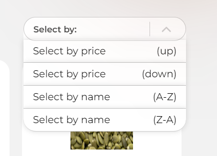

# Project Leaf Store
> In this project I practice with ReactJs, Express and MongoDB.
> It must be real web site with products list , filter, bascet and authorizatin. 
> All changes have saved in MongoDB.

## ** DEPLOY in VERCEL**
[Link to Leaf store](https://leaf-store.vercel.app/ "Link to Leaf store")

## Tech Stack

**Client:** 
+ React
+ React Router Dom
+ Axios

**Server:** 
+ Express
+ MongoDB
+ Hulmet
+ Corn

## Demonstration screens

> Search field 

	

> Filter

	

> Sort by

	

## TODO 
1. Auth
2. Order Form

## END

