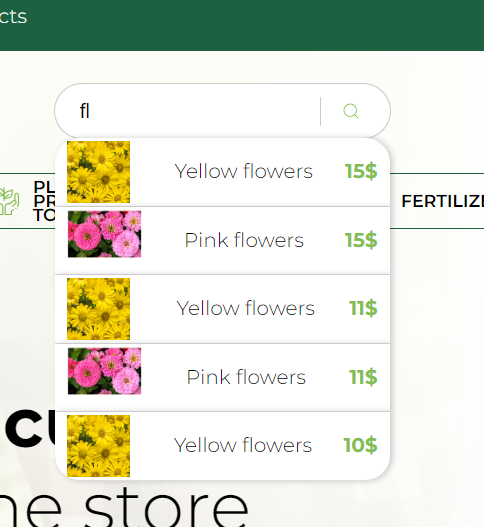
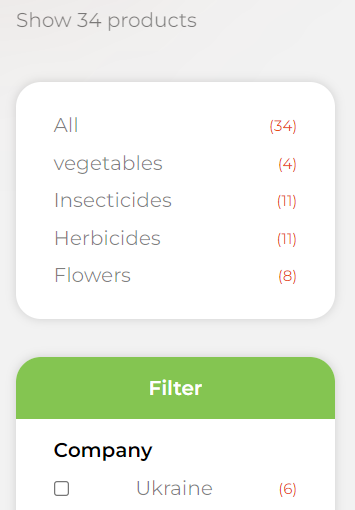

# Project Leaf Store
> this is my demonstrante project.

## ** DEPLOY in VERCEL**
[Link to Leaf store](https://leaf-store.vercel.app/ "Link to Leaf store")

## Tech Stack

**Client:** 
+ React
+ React Router Dom
+ Axios

**Server:** 
+ Express
+ MongoDB
+ Hulmet
+ Corn

## Demonstrated screens
> Search field 

> Filter

> Sort by

## TODO 
1. Auth
2. Order Form

## END

